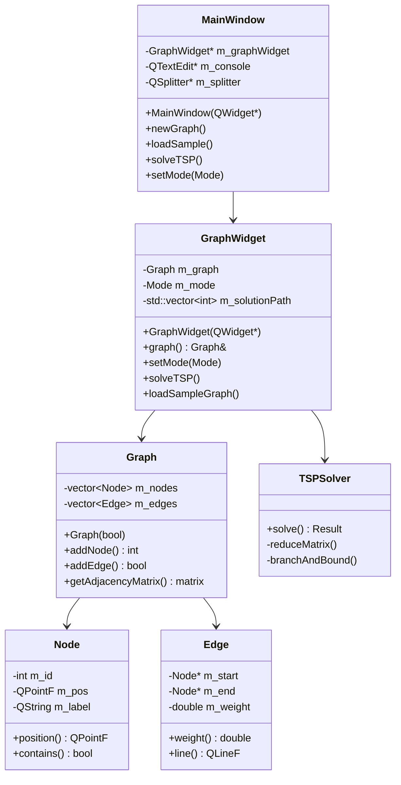
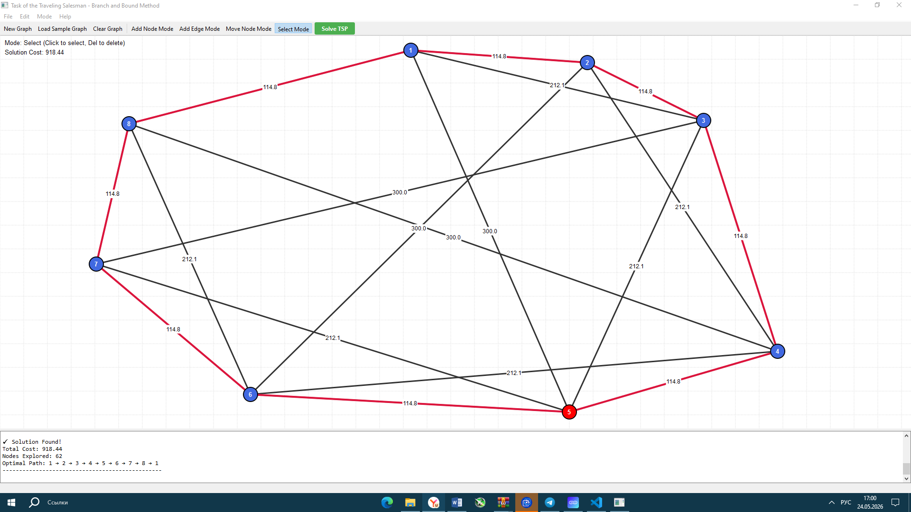

# Лабораторная работа: Задача Коммивояжёра
## Метод ветвей и границ

### Решение задачи коммивояжёра с использованием C++ и Qt

---

## Содержание

1. [Введение](#введение)
2. [Постановка задачи](#постановка-задачи)
3. [Теоретические основы](#теоретические-основы)
4. [Дизайнерские и конструкторские решения](#дизайнерские-и-конструкторские-решения)
5. [UML-диаграмма классов](#uml-диаграмма-классов)
6. [Реализация ключевых классов и функций](#реализация-ключевых-классов-и-функций)
7. [Инструменты и технологии](#инструменты-и-технологии)
8. [Инструкция по сборке и запуску](#инструкция-по-сборке-и-запуску)
9. [Достижения автора](#достижения-автора)
10. [Заключение](#заключение)
11. [Список использованных источников](#список-использованных-источников)

---

## Введение

Задача коммивояжёра (Traveling Salesman Problem, TSP) — одна из классических задач комбинаторной оптимизации. Она заключается в нахождении оптимального маршрута, проходящего через все заданные города ровно по одному разу с минимальными затратами на перемещение.

Данная лабораторная работа демонстрирует решение задачи коммивояжёра методом ветвей и границ с визуализацией процесса и результатов в графическом интерфейсе.

---

2. **Постановка задачи**

Необходимо разработать программу для решения задачи коммивояжёра методом ветвей и границ со следующими требованиями:

1. **Граф**: Двунаправленный граф с не менее чем 6 вершинами
2. **Визуализация**: Построение графа средствами Qt Widgets (QPainter)
3. **Интерактивность**: Добавление/перемещение узлов, установка/разрыв связей
4. **Ввод данных**: Через графический интерфейс Qt
5. **Документация**: UML-диаграмма классов

---

## Теоретические основы

### Метод ветвей и границ

Метод ветвей и границ — это алгоритмическая техника для решения задач дискретной оптимизации. Основная идея заключается в следующем:

1. **Ветвление**: Рекурсивное разбиение множества допустимых решений на подмножества
2. **Оценка**: Вычисление нижней границы целевой функции для каждого подмножества
3. **Отсечение**: Исключение подмножеств, чья нижняя граница превышает текущее лучшее решение

### Алгоритм решения TSP

```
1. Инициализация: Начальная нижняя граница = 0
2. Редукция матрицы стоимостей (вычитание минимальных значений из строк и столбцов)
3. Выбор ребра для ветвления (максимальная оценка исключения)
4. Рекурсивное применение шагов 2-3 для подзадач
5. Отсечение ветвей с оценкой выше текущего лучшего решения
6. Возврат оптимального пути при полном обходе всех городов
```

---

## Дизайнерские и конструкторские решения

### Интерфейс приложения

Приложение разработано с акцентом на удобство использования и наглядность:

#### 1. Многопанельный интерфейс
- Основная область с визуализацией графа (Qt Widgets)
- Консольная панель для вывода результатов
- Разделитель с изменяемым размером панелей

#### 2. Режимы работы

| Режим | Описание | Горячая клавиша |
|-------|----------|-----------------|
| Add Node | Добавление новых вершин кликом | A |
| Add Edge | Создание рёбер между вершинами | E |
| Move Node | Перемещение вершин перетаскиванием | M |
| Select | Выделение и удаление элементов | S |
| Solve | Решение задачи | Enter |

#### 3. Визуальные эффекты

**Цветовое кодирование:**
- Синие узлы — обычный режим
- Зелёный узел — начало создания ребра
- Красный узел/ребро — выделенный элемент
- Малиновый путь — оптимальное решение

**Анимация и обратная связь:**
- Подсветка при наведении
- Стрелки направления на решении
- Отображение весов рёбер

#### 4. Эргономика
- Панель инструментов с быстрым доступом
- Контекстные подсказки в строке состояния
- Кнопка "Solve TSP" с выделенным стилем

#### 5. Пример демонстрационного графа
При запуске автоматически загружается граф с 8 городами, расположенными по кругу с дополнительными связями, что гарантирует существование решения.

---

## UML-диаграмма классов



### Пояснение к UML-диаграмме

| Класс | Назначение |
|-------|------------|
| **MainWindow** | Главное окно приложения, управляет меню и взаимодействием |
| **GraphWidget** | QWidget-виджет для отрисовки и взаимодействия с графом |
| **Graph** | Структура данных, хранящая узлы и рёбра графа |
| **Node** | Представление вершины графа (города) |
| **Edge** | Представление ребра между двумя вершинами с весом |
| **TSPSolver** | Реализация алгоритма ветвей и границ для решения TSP |

---

## Реализация ключевых классов и функций

### 1. Класс TSPSolver — ядро алгоритма

Функция редукции матрицы стоимостей:
```cpp
std::vector<std::vector<double>> TSPSolver::reduceMatrix(
    std::vector<std::vector<double>> matrix, 
    double& reductionCost)
{
    // Редукция по строкам и столбцам
    // Вычитание минимальных значений для получения нижней границы
}
```

Рекурсивная функция ветвей и границ:
```cpp
void TSPSolver::branchAndBound(...)
{
    // Базовый случай: все города посещены
    // Перебор всех непосещённых городов
    // Отсечение ветвей с оценкой хуже текущего лучшего решения
}
```

### 2. Класс GraphWidget — визуализация

```cpp
void GraphWidget::paintEvent(QPaintEvent* event)
{
    QPainter painter(this);
    drawGrid();           // Сетка фона
    drawEdges();          // Рёбра графа
    drawSolutionPath();   // Оптимальный путь
    drawNodes();          // Вершины
    drawEdgeWeights();    // Веса рёбер
}
```

### 3. Класс Graph — управление структурой данных

```cpp
int Graph::addNode(const QPointF& pos, const QString& label);
bool Graph::addEdge(int startId, int endId, double weight);
std::vector<std::vector<double>> Graph::getAdjacencyMatrix() const;
```

---

## Инструменты и технологии

### Среда разработки

| Инструмент | Версия | Назначение |
|------------|--------|------------|
| **VS Code** | Latest | Редактор кода |
| **CMake** | 3.16+ | Система сборки |
| **GCC/Clang** | C++17 | Компилятор |

### Библиотеки и фреймворки

| Библиотека | Назначение |
|------------|------------|
| **Qt 5.15+/Qt6** | GUI фреймворк (Widgets, QPainter) |
| **STL** | Стандартные контейнеры |

---

## Инструкция по сборке и запуску

### Шаг 1: Установка зависимостей

**Ubuntu/Debian:**
```bash
sudo apt-get install build-essential cmake qtbase5-dev
```

**Windows:**
1. Установите Qt Online Installer
2. Выберите компоненты: Qt Widgets
3. Установите CMake и MinGW

### Шаг 2: Сборка
```bash
cd /workspace
mkdir build && cd build
cmake -DCMAKE_PREFIX_PATH="C:\Qt\6.10.2\msvc2022_64" .. 
cmake --build .
C:\Qt\6.10.2\msvc2022_64\bin\windeployqt.exe debug\TSP_BranchAndBound.exe
.\debug\TSP_BranchAndBound.exe
```

### Шаг 3: Запуск

```bash
./TSP_BranchAndBound
```

### Сборка в VS Code

1. Откройте папку проекта в VS Code
2. Установите расширение "CMake Tools"
3. Ctrl+Shift+P → "CMake: Configure"
4. Ctrl+Shift+P → "CMake: Build"
5. F5 для запуска

---

## Достижения автора

### Ключевые достижения

1. **Полная реализация метода ветвей и границ**
   - Корректная редукция матрицы стоимостей
   - Эффективное отсечение неперспективных ветвей

2. **Интерактивный графический интерфейс**
   - 5 режимов взаимодействия с графом
   - Перетаскивание узлов в реальном времени

3. **Профессиональная визуализация**
   - Отрисовка через Qt QPainter с антиалиасингом
   - Цветовое кодирование элементов
   - Стрелки направления на оптимальном пути

4. **Универсальность**
   - Работа с произвольными графами
   - Автоматическое вычисление весов

5. **Документированный код**
   - Doxygen-совместимые комментарии
   - UML-диаграмма архитектуры



---

## Заключение

В ходе выполнения лабораторной работы была успешно разработана программа для решения задачи коммивояжёра методом ветвей и границ.

### Основные результаты:

✅ Реализован алгоритм ветвей и границ  
✅ Создан интерактивный графический интерфейс на Qt  
✅ Реализована визуализация графа средствами Qt Widgets  
✅ Обеспечена возможность создания и редактирования графов  
✅ Подготовлена полная документация с UML-диаграммой  

---

## Список использованных источников

1. Корбт Д., Ли Дж. "Методы ветвей и границ". — М.: Мир, 1974.
2. Пападимитриу Х., Стайглиц К. "Комбинаторная оптимизация". — М.: Мир, 1985.
3. Qt Documentation. https://doc.qt.io/
4. Little J.D.C. et al. "An algorithm for the traveling salesman problem". Operations Research, 1963.
5. Stroustrup B. "The C++ Programming Language". 4th Edition, 2013.

---

**Автор:** Лабораторная работа выполнена в рамках учебного курса  
**Дата:** 2024  
**Язык реализации:** C++17  
**Фреймворк:** Qt 5.15+/Qt6
